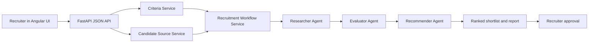

# Recruitment Assistant

Recruitment Assistant is an AI-powered multi-agent application that helps recruiters turn job requirements and approved candidate data into explainable ranked shortlists. The product is inspired by the CrewAI recruitment example and is scoped as a focused MVP/mini-project using three application agents: Researcher, Evaluator, and Recommender.

The assistant is designed as decision support for recruiters and hiring teams. It can help source or select candidate options from approved inputs, evaluate fit against role criteria, and produce ranked recommendations with strengths, gaps, unknowns, confidence, rationale, and suggested next steps. It does not make autonomous hiring decisions.

## Current Status

Current phase: Deliver complete for local/demo handoff.

The MVP has completed the AAMAD Define, Build, and Deliver phases. It includes the Angular recruiter workflow, FastAPI backend, deterministic Researcher -> Evaluator -> Recommender execution path, optional live CrewAI execution and tracing configuration, Docker Compose deployment configuration, structured backend logging, operational runbook, monitoring plan, execution results, and lessons learned.

Validated local checks:

- Backend API tests: `PYTHONPATH=backend pytest -q backend/tests`
- Frontend tests: `npm test -- --watch=false` from `frontend/`
- Frontend production build: `npm run build` from `frontend/`
- Backend API smoke path: health, criteria extraction, candidate preview, recommendation run, and approval capture

Docker Compose is the primary Deliver-phase runtime, but container verification must be run in a Docker-enabled environment.

## Problem Statement

Recruiters and hiring managers often work across fragmented job descriptions, resumes, candidate notes, spreadsheets, and hiring-manager feedback. Creating an initial shortlist is time-consuming because recruiters must interpret role requirements, review candidate evidence, compare profiles consistently, and write summaries that hiring managers can trust.

This project addresses that problem by structuring the first-pass recruiting workflow:

- Convert job requirements into reviewable evaluation criteria.
- Source candidate options from seeded, pasted, uploaded, or otherwise approved data.
- Evaluate candidates consistently against required and preferred criteria.
- Mark missing or ambiguous information as unknown instead of inventing facts.
- Produce explainable ranked recommendations for recruiter review and approval.

## Value Proposition

Recruiters can move from a role requirement to a reviewed candidate shortlist faster, with more consistent evaluation logic and clearer recommendations for hiring managers.

Expected value:

- Reduce manual sourcing, screening, and writeup effort.
- Improve consistency of candidate comparisons.
- Increase hiring-manager trust through visible rationale, caveats, and evidence confidence.
- Preserve human review through criteria review, candidate review, and final recruiter approval.
- Demonstrate a practical CrewAI-style multi-agent workflow for recruitment.

## Key Features

### MVP Must-Haves

- Guided job requirement input with title, description, skills, seniority, and location or remote constraints.
- Candidate source selection from seeded data, pasted profiles, uploaded text, or approved sources.
- Role criteria extraction or capture with recruiter review checkpoint.
- Candidate search or source step using approved data only.
- Automated candidate evaluation against job criteria.
- Ranked candidate shortlist with rationale, strengths, gaps, unknowns, confidence, and next step.
- Recruiter review and approval before recommendations are used or shared.
- AI-assisted decision-support disclosure in final output.
- Safe handling for empty input, vague requirements, no candidates, unapproved sources, model timeouts, malformed outputs, and low-confidence results.

### MVP Nice-To-Haves

- Editable extracted criteria in the frontend.
- Editable recommendation notes or override controls.
- Persistent run history or audit trail.
- Uploaded file parsing beyond plain text.
- Markdown, PDF, DOCX, or ATS-ready export formatting.
- Recruiter-adjustable score weights.

### Out Of Scope For This Mini-Project

- Full ATS integration.
- Automatic email, LinkedIn, SMS, or outreach sending.
- Direct candidate communication.
- Production-grade compliance workflows or bias audit certification.
- Interview scheduling, offer management, onboarding, payroll, or HRIS integration.
- Autonomous candidate rejection, advancement, or hiring decisions.

## Application Architecture Overview

The Deliver-phase MVP is a local/demo full-stack application with an Angular + PrimeNG frontend and a FastAPI backend. The backend exposes typed JSON APIs, runs deterministic recruitment workflow services for reliable demos and tests, and supports optional live CrewAI execution when credentials and model access are configured.

The core product flow remains a sequential application crew. Each agent owns one part of the recruiting assistant process and passes structured output to the next step.



Runtime layers:

- `frontend/`: Angular 21 single-page recruiter workflow using PrimeNG components.
- `backend/app/main.py`: FastAPI app with CORS configured for local frontend ports `4200`, `4300`, and `5173`.
- `backend/app/api/routes.py`: API boundary for health, criteria extraction, candidate preview, recommendation runs, and approval capture.
- `backend/app/schemas/`: Pydantic contracts shared conceptually with the frontend TypeScript models.
- `backend/app/services/`: deterministic criteria, candidate source, workflow, and report services.
- `backend/app/agents/`: Researcher, Evaluator, and Recommender agent classes plus CrewAI YAML descriptors.

### Researcher Agent

Role: searches or selects candidate options from approved inputs.

Responsibilities:

- Interpret job requirements and reviewed criteria.
- Search seeded data, pasted profiles, uploaded text, or approved sources.
- Return candidate options with summaries, source labels, and missing data notes.
- Avoid unauthorized scraping or unsupported data collection.

Outputs:

- Candidate list.
- Candidate profile summaries.
- Source references or source labels.
- Missing data notes.

### Evaluator Agent

Role: evaluates each candidate against job criteria.

Responsibilities:

- Compare candidate profiles against required and preferred criteria.
- Assess required skills, relevant experience, seniority alignment, domain relevance, location/work constraints, and evidence confidence.
- Identify strengths, gaps, and unknowns.
- Avoid unsupported claims or invented candidate facts.

Outputs:

- Candidate fit assessments.
- Strengths and gaps.
- Component scores or qualitative fit ratings.
- Evidence confidence.

### Recommender Agent

Role: turns evaluations into an approved-shortlist workflow.

Responsibilities:

- Rank candidates by overall fit.
- Explain why candidates are recommended.
- Highlight caveats, unknowns, and assumptions.
- Provide recruiter and hiring-manager-friendly next steps.
- Present recommendations as decision support, not final hiring decisions.

Outputs:

- Ranked candidate shortlist.
- Recommendation rationale.
- Suggested next steps.
- Hiring-manager-ready summary.

## Quick Start

The complete operator guide is in the Deliver runbook: [`project-context/3.deliver/runbook.md`](project-context/3.deliver/runbook.md).

### Prerequisites

For local development, contributors need:

- Git.
- Python 3.11 or newer.
- Node.js 20 or newer.
- npm, matching the frontend lockfile workflow.
- Access to approved or seeded candidate data for real workflow testing.
- Docker Engine with Compose v2 for the primary Deliver deployment path.
- Legal/HR approval before using real candidate data or real hiring workflows.

### Docker Demo

From the repository root:

```bash
cp .env.example .env
docker compose build
docker compose up -d
```

Open:

- Frontend: `http://localhost:4200`
- Backend health: `http://localhost:8000/health`
- Backend OpenAPI docs: `http://localhost:8000/docs`

Use seeded dataset `backend_engineers` for the reliable deterministic demo path. Leave `GOOGLE_API_KEY` empty unless testing live CrewAI execution.

### Local Development Setup

Install backend and frontend dependencies:

```bash
python -m venv backend/.venv
source backend/.venv/bin/activate
pip install -r backend/requirements.txt

cd frontend
npm ci
cd ..
```

The root scripts automatically use `backend/.venv` when it exists. Runtime ports are controlled with environment variables:

| Variable | Default | Purpose |
| --- | --- | --- |
| `BACKEND_HOST` | `0.0.0.0` | FastAPI bind host |
| `BACKEND_PORT` | `8000` | FastAPI port |
| `FRONTEND_HOST` | `0.0.0.0` | Angular dev-server bind host |
| `FRONTEND_PORT` | `4200` | Angular dev-server port |

The frontend expects the local backend at `http://localhost:8000`. If the backend is unavailable, the UI preserves demo usability with labeled fallback data.

### Run Locally

Use the root launch scripts:

```bash
./scripts/start-backend.sh
./scripts/start-frontend.sh
```

Or start both in one terminal:

```bash
./scripts/start-dev.sh
```

Default URLs:

- Frontend: `http://localhost:4200`
- Backend: `http://localhost:8000`

Ports can be changed with environment variables:

```bash
BACKEND_PORT=8001 FRONTEND_PORT=4300 ./scripts/start-dev.sh
```

The backend CORS allowlist includes the documented local frontend ports `4200`, `4300`, and `5173` for both `localhost` and `127.0.0.1`.

VS Code launchers are also available:

- Run Task: `Backend: FastAPI`
- Run Task: `Frontend: Angular`
- Run Task: `Full stack: Frontend + Backend`
- Run and Debug: `Full stack: Frontend + Backend`

### Basic Usage

The MVP flow is available through the web UI:

1. Enter or upload job requirements.
2. Review extracted evaluation criteria.
3. Provide approved candidate data or select seeded candidate data.
4. Run the Researcher, Evaluator, and Recommender workflow.
5. Review ranked recommendations, caveats, unknowns, and confidence.
6. Approve or revise the hiring-manager-ready summary.

### Review The Product Context

Start with the approved Define, Build, and Deliver artifacts:

- `project-context/1.define/prd.md` - product requirements and MVP scope.
- `project-context/1.define/mrd.md` - market requirements and product positioning.
- `project-context/1.define/open-questions.md` - unresolved stakeholder, compliance, and implementation questions.
- `project-context/2.build/sad.md` - Build-phase solution architecture.
- `project-context/2.build/setup.md` - environment and launch decisions.
- `project-context/2.build/backend.md` - backend implementation notes.
- `project-context/2.build/frontend.md` - frontend implementation notes.
- `project-context/2.build/qa-plan.md` - QA scenarios, defect log, fixes, verification, and known gaps.
- `project-context/3.deliver/runbook.md` - operator guide for deployment, health checks, monitoring, troubleshooting, and rollback.
- `project-context/3.deliver/deployment-plan.md` - Docker Compose deployment approach and constraints.
- `project-context/3.deliver/monitoring-plan.md` - logging, monitoring, and tracing strategy.
- `LESSONS.md` - lessons learned and AAMAD observations.

### Verification Commands

Run the backend and frontend checks from the repository root:

```bash
PYTHONPATH=backend pytest -q backend/tests

cd frontend
npm test -- --watch=false
npm run build
```

## Project Structure

```text
.
├── AGENTS.md                         # AAMAD/Codex operating instructions
├── CHECKLIST.md                      # Project checklist from framework setup
├── Dockerfile                         # Backend container image
├── docker-compose.yml                 # Deliver-phase local/demo stack
├── .env.example                       # Local/demo runtime configuration template
├── LESSONS.md                         # Lessons learned from the AAMAD project
├── README.md                         # Repository overview and onboarding guide
├── backend/                          # FastAPI backend, schemas, services, agents, and tests
│   ├── app/
│   │   ├── agents/                   # Researcher, Evaluator, Recommender definitions
│   │   ├── api/                      # FastAPI route layer
│   │   ├── schemas/                  # Pydantic API/workflow contracts
│   │   └── services/                 # Deterministic MVP workflow services
│   └── tests/                        # Backend smoke and regression tests
├── frontend/                         # Angular + PrimeNG recruiter workflow
│   ├── Dockerfile                    # Frontend build and nginx image
│   ├── nginx.conf                    # Static serving and health endpoint
│   └── src/app/                      # UI, service client, models, and tests
├── scripts/                          # Local backend/frontend/full-stack launch scripts
├── project-context/
│   ├── 1.define/
│   │   ├── context-summary.md         # Define-phase summary
│   │   ├── mrd.md                     # Market Requirements Document
│   │   ├── open-questions.md          # Open product/business/technical questions
│   │   ├── prd.md                     # Product Requirements Document
│   │   └── sad.md                     # Define-phase architecture notes
│   ├── 2.build/
│   │   ├── architecture-plan.md       # Build sequencing and architecture plan
│   │   ├── backend.md                 # Backend build notes
│   │   ├── frontend.md                # Frontend build notes
│   │   ├── integration.md             # Integration build notes
│   │   ├── qa-plan.md                 # QA scenarios, findings, and verification
│   │   ├── sad.md                     # Build-phase solution architecture
│   │   └── setup.md                   # Environment/setup notes
│   ├── 3.deliver/
│   │   ├── deployment-plan.md         # Docker Compose deployment plan
│   │   ├── deployment.md              # Deployment notes
│   │   ├── execution-results.md       # End-to-end execution evidence
│   │   ├── monitoring-plan.md         # Logging, monitoring, and tracing plan
│   │   ├── operations.md              # Operations notes
│   │   ├── release.md                 # Release readiness notes
│   │   ├── release-notes.md           # Versioned release notes
│   │   └── runbook.md                 # Operator guide
│   └── handoffs/
│       └── README.md                  # Cross-phase handoff notes
├── .codex/aamad/                      # Codex-native AAMAD orchestration material
├── .cursor/                           # Cursor agent/rule assets
├── .claude/                           # Claude Code agent/rule assets
└── .github/                           # VS Code/GitHub Copilot agent assets
```

## Development Status

Current phase: Deliver complete for local/demo handoff.

Completed:

- Product framing, MRD, PRD, and architecture artifacts are documented.
- FastAPI backend is implemented with typed Pydantic contracts and local CORS configuration.
- Deterministic Researcher, Evaluator, and Recommender workflow services are implemented for reliable local demos.
- Optional live CrewAI execution and tracing configuration are implemented.
- Angular + PrimeNG frontend is implemented as a guided recruiter workflow.
- Frontend and backend are wired through JSON APIs for criteria extraction, candidate preview, recommendation runs, and approval capture.
- Docker Compose, root launch scripts, and VS Code tasks/debug launchers are available.
- Structured backend logging is implemented for startup, API requests, workflow execution, agent steps, approvals, and errors.
- Deliver artifacts cover deployment, monitoring, operations, execution evidence, release readiness, runbook, and lessons learned.
- QA findings `QA-001` through `QA-006` are fixed and verified.

Known gaps:

- Approval/run storage is in memory and resets when the backend process restarts.
- Deterministic backend services remain the default path; live CrewAI execution requires valid provider credentials and model access.
- Uploaded candidate data is accepted as plain text in JSON, not multipart file upload.
- Browser-click e2e automation is not installed in the workspace.
- Real candidate data use still requires legal/HR approval.
- Container validation must be run in a Docker-enabled environment when Docker is unavailable in the workspace.

Next:

- Run Docker Compose build/up/health checks in a Docker-enabled environment before external demo handoff.
- Decide whether to add Playwright or another browser e2e runner before production-like release.
- Externalize frontend API URL configuration before deployed demos.
- Replace in-memory run storage with persistent audit/history storage if the MVP moves beyond local demo use.

## Contributor Workstreams

### Product Manager

- Validate delivered MVP behavior with recruiters, hiring managers, or HR/talent operations stakeholders.
- Confirm the primary delivery goal: internal productivity, CrewAI showcase, commercial MVP validation, or responsible AI governance pilot.
- Validate manual baseline time, recruiter cost assumptions, operating cost assumptions, and minimum ROI threshold against the working MVP.
- Keep `project-context/1.define/open-questions.md` current as decisions are made.

### System Architect

- Maintain `project-context/2.build/sad.md` as architecture decisions evolve.
- Review backend/API boundaries, data contracts, storage decisions, timeout handling, and model-output schemas before delivery changes.
- Decide when to replace deterministic MVP services with live CrewAI execution or persistent storage.

### Project Manager

- Coordinate Deliver-phase tasks, release readiness, and handoff notes.
- Keep prerequisites, dependency manifests, and environment-variable expectations current.
- Sequence any remaining frontend, backend, integration, QA, and DevOps follow-ups from the approved PRD scope.
- Document setup decisions in `project-context/2.build/setup.md`.

### Backend Engineer

- Maintain the Researcher, Evaluator, and Recommender workflow.
- Use approved or seeded candidate data only.
- Return structured output with candidate summaries, strengths, gaps, unknowns, confidence, rationale, and next steps.
- Keep tests current for core workflow behavior and safe failure states.

### Frontend Engineer

- Maintain the guided recruiter workflow for job input, candidate source selection, criteria review, evaluation review, and recommendation approval.
- Present ranked shortlist, candidate detail, confidence, caveats, and report-ready summary.
- Keep UI copy aligned with professional, neutral, evidence-based brand voice.

### Integration Engineer

- Maintain frontend/backend API compatibility.
- Validate the path from job requirements to recruiter-approved ranked recommendations after changes.
- Document smoke test results in `project-context/2.build/integration.md`.

### QA Engineer

- Maintain canonical seeded role and candidate fixtures.
- Revalidate required input handling, ambiguity handling, approved-source boundaries, missing evidence, model timeout, malformed output, and low-confidence output after changes.
- Verify that recommendations use neutral, job-related, evidence-based language and include AI-assisted disclosure.

## Success Metrics

The MVP should be evaluated against the following targets:

| Metric | Target |
| --- | --- |
| Time to source candidates | Initial candidate list within 2 minutes for seeded or approved data. |
| Time to ranked shortlist | Under 15 minutes after candidate data is available. |
| Candidate match accuracy | At least 80% of recommendations judged relevant in seeded scenarios. |
| Recommendation explainability | 100% of ranked candidates include rationale tied to job criteria. |
| Evidence quality | 0 unsupported candidate facts in QA fixtures. |
| Recruiter or reviewer satisfaction | 4 out of 5 or higher in review/testing. |
| End-to-end completion | 95% successful runs in controlled test cases. |

## Key Artifacts

Define phase:

- [`project-context/1.define/context-summary.md`](project-context/1.define/context-summary.md) - Define-phase context summary.
- [`project-context/1.define/mrd.md`](project-context/1.define/mrd.md) - Market Requirements Document.
- [`project-context/1.define/prd.md`](project-context/1.define/prd.md) - Product Requirements Document and approved MVP scope.
- [`project-context/1.define/sad.md`](project-context/1.define/sad.md) - Define-phase architecture notes.
- [`project-context/1.define/open-questions.md`](project-context/1.define/open-questions.md) - Product, compliance, and technical open questions.
- [`project-context/1.define/sfs/README.md`](project-context/1.define/sfs/README.md) - Software feature specification index.

Build phase:

- [`project-context/2.build/architecture-plan.md`](project-context/2.build/architecture-plan.md) - Build sequencing and architecture plan.
- [`project-context/2.build/sad.md`](project-context/2.build/sad.md) - Build-phase Solution Architecture Document.
- [`project-context/2.build/setup.md`](project-context/2.build/setup.md) - Environment and setup notes.
- [`project-context/2.build/backend-plan.md`](project-context/2.build/backend-plan.md) - Backend implementation plan.
- [`project-context/2.build/backend.md`](project-context/2.build/backend.md) - Backend implementation notes.
- [`project-context/2.build/frontend-plan.md`](project-context/2.build/frontend-plan.md) - Frontend implementation plan.
- [`project-context/2.build/frontend.md`](project-context/2.build/frontend.md) - Frontend implementation notes.
- [`project-context/2.build/integration-plan.md`](project-context/2.build/integration-plan.md) - Integration plan.
- [`project-context/2.build/integration.md`](project-context/2.build/integration.md) - Integration notes.
- [`project-context/2.build/qa-plan.md`](project-context/2.build/qa-plan.md) - QA scenarios, findings, and verification.
- [`project-context/2.build/qa.md`](project-context/2.build/qa.md) - QA execution notes.
- [`project-context/2.build/logs/README.md`](project-context/2.build/logs/README.md) - Build log artifact guidance.

Deliver phase:

- [`project-context/3.deliver/deployment-plan.md`](project-context/3.deliver/deployment-plan.md) - Docker Compose deployment approach, configuration, verification, and rollback.
- [`project-context/3.deliver/deployment.md`](project-context/3.deliver/deployment.md) - Deployment notes.
- [`project-context/3.deliver/monitoring-plan.md`](project-context/3.deliver/monitoring-plan.md) - Monitoring, logging, and CrewAI tracing plan.
- [`project-context/3.deliver/runbook.md`](project-context/3.deliver/runbook.md) - Operator runbook and quick-start procedure.
- [`project-context/3.deliver/execution-results.md`](project-context/3.deliver/execution-results.md) - End-to-end execution results and logs.
- [`project-context/3.deliver/operations.md`](project-context/3.deliver/operations.md) - Operations notes.
- [`project-context/3.deliver/release.md`](project-context/3.deliver/release.md) - Release readiness notes.
- [`project-context/3.deliver/release-notes.md`](project-context/3.deliver/release-notes.md) - Versioned release notes.
- [`project-context/handoffs/README.md`](project-context/handoffs/README.md) - Cross-phase handoff notes.
- [`LESSONS.md`](LESSONS.md) - Lessons learned from Define, Build, Deliver, and the Agentic Architect role.

Configuration and runtime:

- [`Dockerfile`](Dockerfile) - Backend image.
- [`frontend/Dockerfile`](frontend/Dockerfile) - Frontend image.
- [`docker-compose.yml`](docker-compose.yml) - Local/demo stack.
- [`frontend/nginx.conf`](frontend/nginx.conf) - Frontend nginx configuration and health endpoint.
- [`scripts/start-backend.sh`](scripts/start-backend.sh), [`scripts/start-frontend.sh`](scripts/start-frontend.sh), [`scripts/start-dev.sh`](scripts/start-dev.sh) - Local launch scripts.

## Lessons Learned Summary

The full lessons learned artifact is [`LESSONS.md`](LESSONS.md).

Key takeaways:

- AAMAD worked best when each phase had durable context artifacts and clear handoff notes.
- Agent personas helped separate product, architecture, frontend, backend, integration, QA, DevOps, and review concerns.
- The Agentic Architect role remained essential for validating scope, quality, operational risk, and human-impact decisions.
- Deterministic workflow logic made the MVP reliable for tests and demos while preserving an optional path for live CrewAI execution.
- Deliver work should be grounded in the real runtime: deployment files, logs, trace setup, runbook steps, verification evidence, and rollback notes.
- Candidate-data workflows need conservative guardrails: approved sources, no autonomous hiring decisions, recruiter approval, metadata-only logs, and legal/HR review before real data use.

## Responsible AI And Compliance Notes

This project handles candidate data and hiring-related recommendations, so it must stay within conservative boundaries:

- Recommendations are AI-assisted decision support, not final hiring decisions.
- Recruiter review and approval are required before use.
- Candidate data must come from approved inputs only.
- Protected attributes and unsupported sensitive data must not be used in scoring.
- Legal/HR review is required before using real candidate data or real hiring workflows.
- Production compliance, bias audit certification, and autonomous candidate decisions are out of scope for the mini-project.

Recommended disclosure for MVP outputs:

> These recommendations are AI-assisted decision support based on the supplied job criteria and candidate data. A recruiter must review and approve all recommendations before they are used in a hiring process.

## Sources

- Product Requirements Document: `project-context/1.define/prd.md`
- Market Requirements Document: `project-context/1.define/mrd.md`
- Open Questions: `project-context/1.define/open-questions.md`
- Build Solution Architecture Document: `project-context/2.build/sad.md`
- Build setup notes: `project-context/2.build/setup.md`
- Backend build notes: `project-context/2.build/backend.md`
- Frontend build notes: `project-context/2.build/frontend.md`
- QA plan and verification: `project-context/2.build/qa-plan.md`
- Deployment plan: `project-context/3.deliver/deployment-plan.md`
- Monitoring plan: `project-context/3.deliver/monitoring-plan.md`
- Runbook: `project-context/3.deliver/runbook.md`
- Execution results: `project-context/3.deliver/execution-results.md`
- Release notes: `project-context/3.deliver/release-notes.md`
- Lessons learned: `LESSONS.md`
- CrewAI recruitment example reference: https://github.com/crewAIInc/crewAI-examples/tree/main/crews/recruitment
