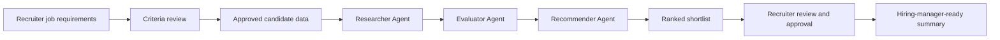

# Recruitment Assistant

Recruitment Assistant is an AI-powered multi-agent application that helps recruiters turn job requirements and approved candidate data into explainable ranked shortlists. The product is inspired by the CrewAI recruitment example and is scoped as a focused MVP/mini-project using three application agents: Researcher, Evaluator, and Recommender.

The assistant is designed as decision support for recruiters and hiring teams. It can help source or select candidate options from approved inputs, evaluate fit against role criteria, and produce ranked recommendations with strengths, gaps, unknowns, confidence, rationale, and suggested next steps. It does not make autonomous hiring decisions.

## Problem Statement

Recruiters and hiring managers often work across fragmented job descriptions, resumes, candidate notes, spreadsheets, and hiring-manager feedback. Creating an initial shortlist is time-consuming because recruiters must interpret role requirements, review candidate evidence, compare profiles consistently, and write summaries that hiring managers can trust.

This project addresses that problem by structuring the first-pass recruiting workflow:

- Convert job requirements into reviewable evaluation criteria.
- Source candidate options from seeded, pasted, uploaded, or otherwise approved data.
- Evaluate candidates consistently against required and preferred criteria.
- Mark missing or ambiguous information as unknown instead of inventing facts.
- Produce explainable ranked recommendations for recruiter review and approval.

## Value Proposition

Recruiters can move from a role requirement to a reviewed candidate shortlist faster, with more consistent evaluation logic and clearer recommendations for hiring managers.

Expected value:

- Reduce manual sourcing, screening, and writeup effort.
- Improve consistency of candidate comparisons.
- Increase hiring-manager trust through visible rationale, caveats, and evidence confidence.
- Preserve human review through criteria review, candidate review, and final recruiter approval.
- Demonstrate a practical CrewAI-style multi-agent workflow for recruitment.

## Key Features

### MVP Must-Haves

- Guided job requirement input with title, description, skills, seniority, and location or remote constraints.
- Candidate source selection from seeded data, pasted profiles, uploaded text, or approved sources.
- Role criteria extraction or capture with recruiter review checkpoint.
- Candidate search or source step using approved data only.
- Automated candidate evaluation against job criteria.
- Ranked candidate shortlist with rationale, strengths, gaps, unknowns, confidence, and next step.
- Recruiter review and approval before recommendations are used or shared.
- AI-assisted decision-support disclosure in final output.
- Safe handling for empty input, vague requirements, no candidates, unapproved sources, model timeouts, malformed outputs, and low-confidence results.

### MVP Nice-To-Haves

- Editable extracted criteria in the frontend.
- Editable recommendation notes or override controls.
- Persistent run history or audit trail.
- Uploaded file parsing beyond plain text.
- Markdown, PDF, DOCX, or ATS-ready export formatting.
- Recruiter-adjustable score weights.

### Out Of Scope For This Mini-Project

- Full ATS integration.
- Automatic email, LinkedIn, SMS, or outreach sending.
- Direct candidate communication.
- Production-grade compliance workflows or bias audit certification.
- Interview scheduling, offer management, onboarding, payroll, or HRIS integration.
- Autonomous candidate rejection, advancement, or hiring decisions.

## Application Architecture Overview

The application uses a sequential multi-agent workflow. Each agent owns one part of the recruiting assistant process and passes structured output to the next step.



### Researcher Agent

Role: searches or selects candidate options from approved inputs.

Responsibilities:

- Interpret job requirements and reviewed criteria.
- Search seeded data, pasted profiles, uploaded text, or approved sources.
- Return candidate options with summaries, source labels, and missing data notes.
- Avoid unauthorized scraping or unsupported data collection.

Outputs:

- Candidate list.
- Candidate profile summaries.
- Source references or source labels.
- Missing data notes.

### Evaluator Agent

Role: evaluates each candidate against job criteria.

Responsibilities:

- Compare candidate profiles against required and preferred criteria.
- Assess required skills, relevant experience, seniority alignment, domain relevance, location/work constraints, and evidence confidence.
- Identify strengths, gaps, and unknowns.
- Avoid unsupported claims or invented candidate facts.

Outputs:

- Candidate fit assessments.
- Strengths and gaps.
- Component scores or qualitative fit ratings.
- Evidence confidence.

### Recommender Agent

Role: turns evaluations into an approved-shortlist workflow.

Responsibilities:

- Rank candidates by overall fit.
- Explain why candidates are recommended.
- Highlight caveats, unknowns, and assumptions.
- Provide recruiter and hiring-manager-friendly next steps.
- Present recommendations as decision support, not final hiring decisions.

Outputs:

- Ranked candidate shortlist.
- Recommendation rationale.
- Suggested next steps.
- Hiring-manager-ready summary.

## Getting Started

The MVP now includes a FastAPI backend and an Angular + PrimeNG frontend.

### Prerequisites

For the current Define-phase repository state, contributors need:

- Git.
- Python 3.11 or newer for the expected backend environment.
- Node.js 20 or newer for the expected frontend environment once the UI is added.
- Access to approved or seeded candidate data for any real workflow testing.
- Legal/HR approval before using real candidate data or real hiring workflows.

### Installation

Install backend and frontend dependencies:

```bash
git clone <repo-url>
cd recruitment-assistant
python -m venv backend/.venv
source backend/.venv/bin/activate
pip install -r backend/requirements.txt
cd frontend
npm install
cd ..
```

### Run Locally

Use the root launch scripts:

```bash
./scripts/start-backend.sh
./scripts/start-frontend.sh
```

Or start both in one terminal:

```bash
./scripts/start-dev.sh
```

Default URLs:

- Frontend: `http://localhost:4200`
- Backend: `http://localhost:8000`

Ports can be changed with environment variables:

```bash
BACKEND_PORT=8001 FRONTEND_PORT=4300 ./scripts/start-dev.sh
```

VS Code launchers are also available:

- Run Task: `Backend: FastAPI`
- Run Task: `Frontend: Angular`
- Run Task: `Full stack: Frontend + Backend`
- Run and Debug: `Full stack: Frontend + Backend`

### Basic Usage

Basic usage will be completed during the Build phase after the backend crew workflow and frontend or caller interface exist.

Planned MVP flow:

1. Enter or upload job requirements.
2. Review extracted evaluation criteria.
3. Provide approved candidate data or select seeded candidate data.
4. Run the Researcher, Evaluator, and Recommender workflow.
5. Review ranked recommendations, caveats, unknowns, and confidence.
6. Approve or revise the hiring-manager-ready summary.

### Review The Product Context

Start with the approved Define-phase artifacts:

- `project-context/1.define/prd.md` - product requirements and MVP scope.
- `project-context/1.define/mrd.md` - market requirements and product positioning.
- `project-context/1.define/open-questions.md` - unresolved stakeholder, compliance, and implementation questions.
- `project-context/1.define/sad.md` - architecture document placeholder to be completed before or during Build.

### Confirm MVP Decisions

Before implementation, confirm:

- Candidate data source for the MVP: seeded data, pasted profiles, uploaded text, or approved API.
- Scoring style: numeric score, qualitative label, or both.
- Required candidate fields for first implementation.
- Whether frontend editing is in scope or the MVP only supports review and approval checkpoints.
- AI-assisted disclosure language for UI and reports.

### Build The MVP

Recommended implementation order:

1. Complete or update `project-context/1.define/sad.md` with architecture decisions.
2. Add seeded candidate data and canonical QA fixtures.
3. Implement backend services for Researcher, Evaluator, and Recommender workflow.
4. Implement guided frontend or chat-like recruiter flow.
5. Integrate frontend or caller workflow with backend APIs.
6. Add QA coverage for happy path, ambiguous inputs, missing data, unapproved sources, low-confidence results, timeout handling, malformed outputs, and brand-voice checks.

## Project Structure

```text
.
├── AGENTS.md                         # AAMAD/Codex operating instructions
├── CHECKLIST.md                      # Project checklist from framework setup
├── README.md                         # Repository overview and onboarding guide
├── backend/                          # Backend implementation target
├── frontend/                         # Frontend implementation target
├── project-context/
│   ├── 1.define/
│   │   ├── context-summary.md         # Define-phase summary
│   │   ├── mrd.md                     # Market Requirements Document
│   │   ├── open-questions.md          # Open product/business/technical questions
│   │   ├── prd.md                     # Product Requirements Document
│   │   └── sad.md                     # Solution Architecture Document placeholder
│   ├── 2.build/
│   │   ├── backend.md                 # Backend build notes
│   │   ├── frontend.md                # Frontend build notes
│   │   ├── integration.md             # Integration build notes
│   │   ├── qa.md                      # QA plan/results notes
│   │   └── setup.md                   # Environment/setup notes
│   ├── 3.deliver/
│   │   ├── deployment.md              # Deployment notes
│   │   ├── operations.md              # Operations notes
│   │   └── release.md                 # Release readiness notes
│   └── handoffs/
│       └── README.md                  # Cross-phase handoff notes
├── .codex/aamad/                      # Codex-native AAMAD orchestration material
├── .cursor/                           # Cursor agent/rule assets
├── .claude/                           # Claude Code agent/rule assets
└── .github/                           # VS Code/GitHub Copilot agent assets
```

## Development Status

Current phase: Define.

Completed:

- Product framing, problem statement, value proposition, and MVP scope are documented.
- MRD and PRD artifacts exist under `project-context/1.define/`.
- Application crew roles are defined as Researcher, Evaluator, and Recommender.
- Development crew mapping is documented for Product Manager, System Architect, Project Manager, Backend Engineer, Frontend Engineer, Integration Engineer, and QA Engineer.
- AAMAD/Codex operating instructions and project-context structure are present.
- Open questions are captured for stakeholder, compliance, data-source, and implementation decisions.

Next:

- Complete `project-context/1.define/sad.md` with concrete architecture decisions.
- Confirm approved candidate data source, scoring style, required fields, and disclosure language.
- Add Build-phase setup files and dependency manifests.
- Implement backend crew workflow and frontend or caller interface.
- Add fixtures, tests, integration smoke checks, and QA results.
- Prepare Deliver-phase deployment, operations, and release notes when the MVP is runnable.

## Contributor Workstreams

### Product Manager

- Validate real user personas with recruiters, hiring managers, or HR/talent operations stakeholders.
- Confirm the primary organizational goal: internal productivity, CrewAI showcase, commercial MVP validation, or responsible AI governance pilot.
- Validate manual baseline time, recruiter cost assumptions, operating cost assumptions, and minimum ROI threshold.
- Keep `project-context/1.define/open-questions.md` current as decisions are made.

### System Architect

- Complete `project-context/1.define/sad.md`.
- Define backend/API boundaries, data contracts, storage decisions, timeout handling, and model-output schemas.
- Confirm how intermediate agent outputs are persisted or returned for recruiter review.

### Project Manager

- Scaffold Build-phase project structure and setup tasks.
- Confirm prerequisites, dependency manifests, and environment-variable expectations.
- Sequence frontend, backend, integration, and QA workstreams from the approved PRD scope.
- Document setup decisions in `project-context/2.build/setup.md`.

### Backend Engineer

- Implement the Researcher, Evaluator, and Recommender workflow.
- Use approved or seeded candidate data only.
- Return structured output with candidate summaries, strengths, gaps, unknowns, confidence, rationale, and next steps.
- Add tests for core workflow behavior and safe failure states.

### Frontend Engineer

- Build the guided recruiter workflow for job input, candidate source selection, criteria review, evaluation review, and recommendation approval.
- Present ranked shortlist, candidate detail, confidence, caveats, and report-ready summary.
- Keep UI copy aligned with professional, neutral, evidence-based brand voice.

### Integration Engineer

- Connect frontend or caller workflow to backend APIs.
- Validate the path from job requirements to recruiter-approved ranked recommendations.
- Document smoke test results in `project-context/2.build/integration.md`.

### QA Engineer

- Create canonical seeded role and candidate fixtures.
- Validate required input handling, ambiguity handling, approved-source boundaries, missing evidence, model timeout, malformed output, and low-confidence output.
- Verify that recommendations use neutral, job-related, evidence-based language and include AI-assisted disclosure.

## Success Metrics

The MVP should be evaluated against the following targets:

| Metric | Target |
| --- | --- |
| Time to source candidates | Initial candidate list within 2 minutes for seeded or approved data. |
| Time to ranked shortlist | Under 15 minutes after candidate data is available. |
| Candidate match accuracy | At least 80% of recommendations judged relevant in seeded scenarios. |
| Recommendation explainability | 100% of ranked candidates include rationale tied to job criteria. |
| Evidence quality | 0 unsupported candidate facts in QA fixtures. |
| Recruiter or reviewer satisfaction | 4 out of 5 or higher in review/testing. |
| End-to-end completion | 95% successful runs in controlled test cases. |

## Responsible AI And Compliance Notes

This project handles candidate data and hiring-related recommendations, so it must stay within conservative boundaries:

- Recommendations are AI-assisted decision support, not final hiring decisions.
- Recruiter review and approval are required before use.
- Candidate data must come from approved inputs only.
- Protected attributes and unsupported sensitive data must not be used in scoring.
- Legal/HR review is required before using real candidate data or real hiring workflows.
- Production compliance, bias audit certification, and autonomous candidate decisions are out of scope for the mini-project.

Recommended disclosure for MVP outputs:

> These recommendations are AI-assisted decision support based on the supplied job criteria and candidate data. A recruiter must review and approve all recommendations before they are used in a hiring process.

## Sources

- Product Requirements Document: `project-context/1.define/prd.md`
- Market Requirements Document: `project-context/1.define/mrd.md`
- Open Questions: `project-context/1.define/open-questions.md`
- CrewAI recruitment example reference: https://github.com/crewAIInc/crewAI-examples/tree/main/crews/recruitment
