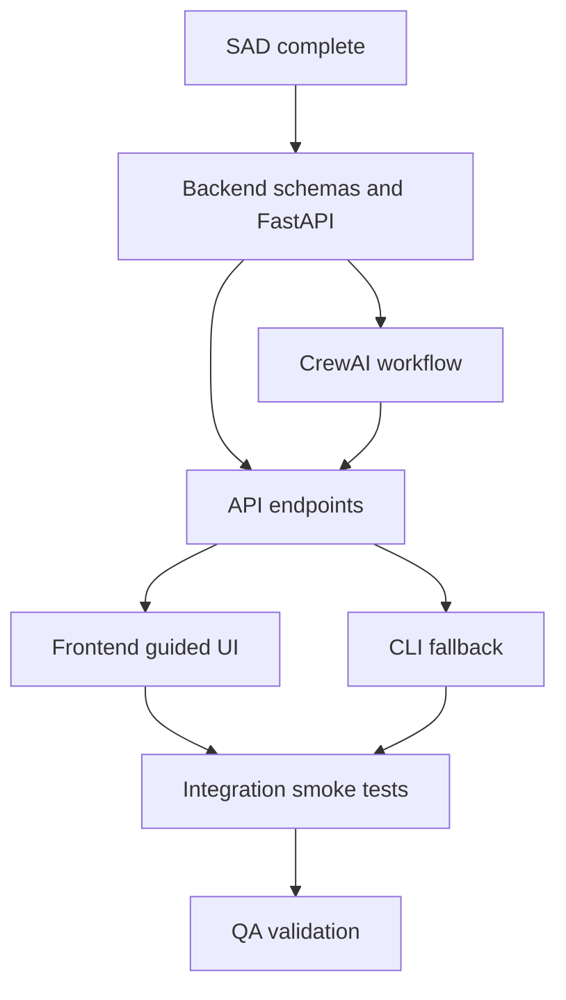

# Architecture Implementation Plan

## Purpose

This plan turns the Build-phase SAD into an implementation sequence for the Recruitment Assistant MVP. It is intended for AAMAD build personas to coordinate backend, frontend, integration, and QA work without expanding beyond the PRD scope.

## Current Status

| Area | Status | Notes |
| --- | --- | --- |
| PRD review | Complete | Source: `project-context/1.define/prd.md` |
| Architecture document | Complete | Created at `project-context/2.build/sad.md` |
| Runtime selection | Complete | `crewai` |
| Backend implementation | Not started | FastAPI + CrewAI workflow recommended |
| Frontend implementation | Not started | Simple guided web UI recommended |
| CLI fallback | Not started | Useful for QA and demos |
| Integration | Not started | API contracts defined in SAD |
| QA fixtures | Not started | Seeded candidate scenarios needed |
| Deployment | Deferred | Local MVP first |

## Implementation Approach

### Phase 1: Backend Foundation

Owner: Backend Engineer

Status: Not started

Tasks:

- Create backend package structure under `backend/`.
- Add FastAPI application entrypoint and `/health` endpoint.
- Define Pydantic schemas for job input, criteria, candidate source, candidate profile, evaluation, recommendation, and approval.
- Implement source allowlist for `seeded`, `pasted`, `uploaded_text`, and future `approved_api`.
- Add seeded candidate fixture loader.
- Add controlled error model for validation, unsupported source, timeout, and malformed agent output.

Acceptance criteria:

- Backend starts locally.
- `/health` returns success.
- Invalid job input and unsupported source return structured errors.
- No secrets are hardcoded.

### Phase 2: CrewAI Workflow

Owner: Backend Engineer

Status: Not started

Tasks:

- Add CrewAI agent and task configuration for Researcher, Evaluator, and Recommender.
- Implement `recruitment_workflow.py` as the service boundary used by API and CLI.
- Implement Researcher source tools for seeded data and pasted profiles.
- Validate each agent output with Pydantic before passing it downstream.
- Add retry-once behavior for malformed model output.
- Add timeout handling and safe failure response.

Acceptance criteria:

- Seeded happy path returns candidates, evaluations, ranked shortlist, report summary, and disclosure.
- Missing candidate facts are marked unknown.
- Final output requires recruiter approval.
- Seeded flow completes under 2 minutes in controlled testing.

### Phase 3: API Layer

Owner: Backend Engineer, Integration Engineer

Status: Not started

Tasks:

- Implement `POST /api/criteria/extract`.
- Implement `POST /api/candidates/preview`.
- Implement `POST /api/recommendations/run`.
- Implement `POST /api/recommendations/{run_id}/approval`.
- Optionally implement `GET /api/recommendations/{run_id}` if local persistence is enabled.
- Generate or verify OpenAPI docs.

Acceptance criteria:

- API contracts match `project-context/2.build/sad.md`.
- Approval endpoint records `approved`, `rejected`, or `needs_edits`.
- API errors preserve submitted inputs where possible.

### Phase 4: Simple Recruiter Interface

Owner: Frontend Engineer

Status: Not started

Tasks:

- Build a guided job requirement form.
- Add criteria review panel with ambiguity warnings.
- Add candidate source selection for seeded data and pasted profiles.
- Add workflow progress and error states.
- Render ranked shortlist with candidate detail expansion.
- Add approval panel and report preview with AI-assisted disclosure.

Acceptance criteria:

- Recruiter can complete the MVP flow from job input to recommendation review.
- Criteria review and final approval checkpoints are visible.
- Each candidate recommendation shows rationale, strengths, gaps, unknowns, confidence, and next step.
- UI does not imply autonomous hiring decisions.

### Phase 5: CLI Fallback

Owner: Backend Engineer, QA Engineer

Status: Not started

Tasks:

- Add CLI command that calls the same workflow service as the API.
- Support job input from file and seeded candidate dataset selection.
- Write optional run result JSON to `project-context/2.build/logs/`.

Acceptance criteria:

- QA can run seeded happy path without the web UI.
- CLI output includes run status, ranked shortlist, disclosure, and approval pending state.

### Phase 6: Integration Validation

Owner: Integration Engineer

Status: Not started

Tasks:

- Smoke test frontend to backend API calls.
- Validate full run with seeded data.
- Confirm errors display correctly for empty input, unsupported source, no candidates, and malformed output simulation.
- Record integration notes in `project-context/2.build/integration.md`.

Acceptance criteria:

- End-to-end seeded run succeeds.
- Recruiter approval updates are accepted by backend.
- UI and API use the same schema expectations.

### Phase 7: QA And Release Readiness

Owner: QA Engineer

Status: Not started

Tasks:

- Create canonical seeded job and candidate fixtures.
- Test happy path and required edge cases from the PRD.
- Check neutral, evidence-based recommendation language.
- Check that final output includes disclosure and recruiter-review requirement.
- Record results, known gaps, and residual risks in `project-context/2.build/qa.md`.

Acceptance criteria:

- Required functional requirements have passing tests or documented gaps.
- Unsupported claims are not present in seeded expected outputs.
- Unapproved source requests are blocked.
- Low-confidence outputs are visibly marked and require recruiter review.

## Workstream Dependencies

## Implementation Order

1. Backend schemas and validation.
2. Seeded candidate fixture source.
3. CrewAI sequential workflow.
4. Recommendation run API.
5. Criteria and candidate preview APIs.
6. CLI fallback.
7. Guided web UI.
8. Approval endpoint and report preview.
9. Integration smoke tests.
10. QA edge case and language checks.

## Decisions To Carry Forward

| Decision | Implementation impact |
| --- | --- |
| FastAPI backend | Backend package should be Python-first and expose OpenAPI contracts |
| CrewAI sequential process | Agent tasks should execute Researcher -> Evaluator -> Recommender |
| Simple guided web UI | UI should focus on workflow checkpoints over a general chatbot |
| CLI fallback | Workflow service must be callable outside HTTP |
| Structured JSON contracts | Pydantic schemas should be source of truth for API and agent validation |
| Approved sources only | Source allowlist must block unsupported sourcing |
| Human approval required | Final recommendation state starts as `pending` |

## Known Gaps

- No actual backend or frontend code exists yet.
- Candidate fixtures are not defined.
- Exact model/provider selection is not confirmed.
- Legal/HR-approved disclosure language is not confirmed.
- Real candidate data retention policy is not confirmed.
- Database-backed audit history is deferred.
- Deployment architecture is intentionally deferred until local MVP is working.

## Sources

- `project-context/1.define/prd.md`
- `project-context/1.define/open-questions.md`
- `project-context/2.build/sad.md`
- `.cursor/templates/sad-template.md`
- `.codex/aamad/personas/system-arch.md`
- `.codex/aamad/adapters/crewai.md`

## Assumptions

- The MVP will start with seeded candidate data because it is safest and easiest to verify.
- Pasted candidate profiles are the next source to support after seeded data.
- A simple web UI is preferred over a full assistant-ui implementation for this module unless scope changes.
- Numeric and qualitative fit labels will both be returned unless the product owner chooses one.

## Open Questions

- Which seeded roles and candidates should become canonical QA fixtures?
- Should uploaded plain text be included in the first implementation or deferred behind seeded and pasted profiles?
- Should approval notes be stored only in run output or in a local persistent file?
- Which model/provider should CrewAI use in local development?
- What input size limits should apply to pasted profiles and uploaded text?

## Verification

- Plan created after reviewing the PRD, SAD template, AAMAD System Architect persona, CrewAI adapter notes, and Build-phase artifact structure.
- Plan aligns with `project-context/2.build/sad.md` and keeps deployment out of scope until local MVP is implemented.

## Handoff Notes

- Start backend work before frontend polish, because the UI depends on stable schemas and response shapes.
- Keep candidate source adapters small and explicit.
- Add QA fixtures early so agent prompt changes can be evaluated against stable examples.
- Do not use real candidate data until approved source, retention, and legal/HR review questions are resolved.

## Audit

| Field | Value |
| --- | --- |
| Date | May 11, 2026 |
| Persona | System Architect |
| Action | Create architecture implementation plan |
| Output | `project-context/2.build/architecture-plan.md` |
| Runtime | `crewai` |
