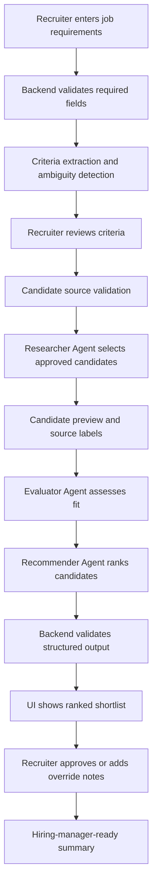

# Solution Architecture Document: Recruitment Assistant

## 1. MVP Architecture Philosophy & Principles

### Purpose

This Solution Architecture Document defines the Build-phase architecture for the Recruitment Assistant MVP. It translates the approved PRD into an implementation blueprint for a CrewAI-powered recruitment workflow with a lightweight recruiter interface and a FastAPI backend.

### MVP Architecture Philosophy

The MVP should prove the core value proposition: a recruiter can move from job requirements and approved candidate data to an explainable ranked shortlist faster than a manual first-pass process, while preserving human review and approved-data boundaries.

The architecture prioritizes:

- A deterministic sequential CrewAI workflow over complex autonomous orchestration.
- Approved candidate inputs only: seeded data, pasted profiles, uploaded plain text, or explicitly approved APIs.
- Structured JSON outputs that can be validated before display.
- Recruiter checkpoints before evaluation and before final recommendation use.
- Safe failure behavior for empty input, vague criteria, no candidates, malformed model output, timeouts, and unsupported sources.
- Minimal storage for the mini-project, with a clear migration path to persistent audit history.

### Selected Runtime

Resolved runtime: `crewai`.

CrewAI is used for the application crew containing the Researcher, Evaluator, and Recommender agents. The backend service owns orchestration, schema validation, retries, timeout handling, and API responses.

### Core vs. Future Decision Framework

| Category | MVP build decision | Future expansion |
| --- | --- | --- |
| Agent workflow | Three sequential agents: Researcher, Evaluator, Recommender | Parallel sourcing, specialist compliance reviewer, hierarchical crews |
| Candidate source | Seeded data, pasted profiles, uploaded plain text, approved source adapter | ATS, job boards, LinkedIn, HRIS, resume parsing for PDF/DOCX |
| Interface | Simple guided web UI, with CLI fallback for demo and QA | Next.js assistant-ui, richer dashboard, persistent history |
| Backend | FastAPI service with Pydantic contracts | Split services, queue-backed jobs, streaming progress |
| Storage | In-memory or file-backed run artifact for mini-project | SQLite/PostgreSQL audit trail and run history |
| Export | Markdown or JSON report output | PDF, DOCX, ATS-ready export |
| Compliance | Decision-support language, source labels, human approval | Legal-reviewed compliance workflows, audit reporting, retention controls |

### Key Architecture Decisions

| Decision | Selection | Rationale |
| --- | --- | --- |
| Backend framework | FastAPI | Strong Python fit for CrewAI, Pydantic validation, OpenAPI docs, async-compatible endpoints |
| UI approach | Simple web UI with CLI fallback | Matches PRD requirement for guided frontend or chat-like workflow while keeping the mini-project feasible |
| Crew process | Sequential | Required flow depends on validated criteria, candidate sourcing, evaluation, then ranking |
| Output format | Structured JSON plus report-ready Markdown | Makes outputs renderable in UI, testable by QA, and exportable for demo |
| Persistence | Optional local run artifacts for MVP | PRD treats full audit logging as nice-to-have; run output may represent approval decision |
| Data sourcing | Whitelisted source adapters | Prevents unauthorized scraping and unsupported candidate claims |

## 2. Multi-Agent System Specification

### Crew Composition

The application crew contains exactly three MVP agents:

| Agent | Role | Goal | Primary inputs | Primary outputs |
| --- | --- | --- | --- | --- |
| Researcher | Candidate source agent | Find or select candidate options from approved data | Reviewed job criteria, source selection, candidate data | Candidate list, summaries, source labels, missing data notes |
| Evaluator | Fit assessment agent | Evaluate candidates consistently against job criteria | Job criteria, sourced candidate profiles | Strengths, gaps, unknowns, fit rating, component scores, evidence confidence |
| Recommender | Ranking and report agent | Rank candidates and create recruiter-reviewable recommendations | Evaluations, job criteria | Ranked shortlist, rationale, caveats, suggested next steps, report summary |

### Agent Roles, Goals, And Constraints

#### Researcher Agent

Responsibilities:

- Interpret reviewed job criteria.
- Select or retrieve candidates from approved sources only.
- Normalize candidate profiles into a consistent schema.
- Preserve source labels and missing information.
- Avoid unauthorized scraping or unapproved external search.

Tools:

- `SeededCandidateStore`: searches local fixture data.
- `PastedProfileParser`: parses recruiter-provided plain text.
- `UploadedTextParser`: parses uploaded `.txt` or plain text payloads if implemented.
- `ApprovedSourceAdapter`: placeholder interface for future approved APIs.

Expected output:

```json
{
  "candidates": [
    {
      "candidate_id": "cand_001",
      "display_name": "Candidate A",
      "profile_summary": "Concise source-backed summary.",
      "skills": ["Python", "FastAPI"],
      "experience": ["Backend API development"],
      "location": "Remote",
      "source_labels": ["seeded-data:backend-engineers"],
      "missing_data": ["Compensation expectations unknown"]
    }
  ],
  "source_warnings": []
}
```

#### Evaluator Agent

Responsibilities:

- Compare candidates against required and preferred criteria.
- Mark missing or ambiguous evidence as `unknown`.
- Avoid scoring protected attributes, personal traits, or unsupported facts.
- Provide concise, job-related strengths and gaps.
- Produce consistent fit ratings that are explainable to a recruiter.

Evaluation dimensions:

- Required skills match.
- Preferred skills match.
- Relevant experience.
- Seniority alignment.
- Domain or industry relevance.
- Location or work arrangement constraints, when provided.
- Evidence confidence.

Expected output:

```json
{
  "evaluations": [
    {
      "candidate_id": "cand_001",
      "fit_label": "strong",
      "overall_score": 84,
      "component_scores": {
        "required_skills": 90,
        "preferred_skills": 70,
        "experience": 85,
        "seniority": 80,
        "location": 100,
        "evidence_confidence": 75
      },
      "strengths": ["Strong evidence of Python and API development."],
      "gaps": ["No direct evidence of ATS integration experience."],
      "unknowns": ["Availability unknown."],
      "rationale": "Source-backed assessment tied to role criteria."
    }
  ]
}
```

#### Recommender Agent

Responsibilities:

- Rank evaluated candidates by fit.
- Explain ranking differences without presenting a hiring decision.
- Highlight caveats, low-confidence results, and material assumptions.
- Produce a hiring-manager-ready summary that includes AI-assisted disclosure.
- Require recruiter review and approval before use.

Expected output:

```json
{
  "ranked_shortlist": [
    {
      "rank": 1,
      "candidate_id": "cand_001",
      "display_name": "Candidate A",
      "fit_label": "strong",
      "overall_score": 84,
      "recommendation_rationale": "Candidate A has strong evidence against required backend skills.",
      "strengths": ["Python", "FastAPI"],
      "gaps": ["ATS integration unknown"],
      "unknowns": ["Availability"],
      "suggested_next_step": "Recruiter review, then consider hiring-manager screen."
    }
  ],
  "summary": "Report-ready shortlist summary.",
  "disclosure": "These recommendations are AI-assisted decision support based on the supplied job criteria and candidate data. A recruiter must review and approve all recommendations before they are used in a hiring process."
}
```

### Task Orchestration

The MVP uses sequential CrewAI processing:

1. Validate job requirement input.
2. Extract or normalize role criteria.
3. Show criteria for recruiter review.
4. Validate candidate source selection against approved source types.
5. Run Researcher Agent.
6. Optionally show candidate list for recruiter review when user-provided data is ambiguous.
7. Run Evaluator Agent.
8. Validate evaluator JSON output.
9. Run Recommender Agent.
10. Validate recommendation JSON output.
11. Return final shortlist to the UI for recruiter review, edits where supported, and approval.

### CrewAI Configuration

Recommended implementation shape:

```text
backend/
  app/
    agents/
      agents.yaml
      tasks.yaml
      crew.py
    services/
      criteria_service.py
      candidate_sources.py
      recruitment_workflow.py
      report_service.py
    schemas/
      recruitment.py
    api/
      routes.py
```

CrewAI settings:

- `process`: sequential.
- `memory`: disabled for MVP unless explicitly scoped per run.
- `cache`: optional for seeded candidate search only.
- `verbose`: enabled in development, disabled or redacted in shared logs.
- `max_execution_time`: target under 120 seconds for seeded data.
- `max_retries`: one retry for malformed agent output; controlled failure after retry.
- `tool_whitelist`: seeded store, pasted text parser, uploaded text parser, approved API adapters only.

### Error Handling And Retry

| Failure | Backend behavior | User-facing behavior |
| --- | --- | --- |
| Empty title or description | Return validation error before crew run | Ask recruiter to add required fields |
| Vague or conflicting criteria | Return criteria warnings and require confirmation or caveat | Show review checkpoint |
| Unapproved source | Block workflow before crew run | Explain acceptable source options |
| No candidates | Return empty result with recovery guidance | Suggest adding candidates or refining criteria |
| Timeout | Cancel run and preserve submitted input | Show retryable error |
| Malformed agent output | Retry once, then fail safely | Avoid partial unsupported recommendations |
| Low-confidence evaluations | Return shortlist with warning and approval requirement | Mark results low-confidence |
| Sensitive unsupported data | Exclude from scoring and flag warning | Tell recruiter it was not used for scoring |

## 3. Frontend Architecture Specification

### MVP Interface Decision

The PRD allows a compact web UI or chat-like guided flow. The recommended MVP interface is a simple web UI backed by FastAPI endpoints, with a CLI fallback for demo and QA automation.

The `.cursor/templates/sad-template.md` references Next.js and assistant-ui for a richer Phase 3 experience. For this mini-project, those remain an optional future upgrade unless the build team explicitly chooses that stack. The required architecture is framework-neutral at the API boundary.

### Primary Web UI Flow

The UI should implement a guided recruiter workflow:

1. Job requirement entry.
2. Criteria extraction and review.
3. Candidate source selection.
4. Candidate review checkpoint.
5. Evaluation and recommendation run.
6. Ranked shortlist review.
7. Approval and report-ready summary.

### UI Components

| Component | Purpose |
| --- | --- |
| JobRequirementForm | Captures title, description, required skills, preferred skills, seniority, location, and source type |
| CriteriaReviewPanel | Shows extracted criteria, ambiguity warnings, and confirmation state |
| CandidateSourcePanel | Supports seeded data, pasted profiles, and uploaded plain text where implemented |
| CandidateListPanel | Shows sourced candidates, profile summaries, source labels, and missing data |
| RunProgressPanel | Shows current workflow step and retryable errors |
| RankedShortlistPanel | Shows ranks, fit labels, rationale, strengths, gaps, unknowns, and next steps |
| CandidateDetailDrawer | Expands per-candidate evidence and criterion-by-criterion assessment |
| ApprovalPanel | Captures recruiter approval, rejection, or manual override notes |
| ReportPreview | Shows hiring-manager-ready summary and disclosure |

### Frontend State

Minimum state model:

- `jobInput`: raw recruiter-provided role fields.
- `criteria`: extracted and reviewed criteria.
- `sourceSelection`: source type and source payload metadata.
- `candidatePreview`: sourced candidates, if previewed.
- `runStatus`: pending, validating, researching, evaluating, recommending, failed, complete.
- `recommendationResult`: final structured output.
- `approval`: approved, rejected, needs edits, override notes.

### CLI Fallback

The CLI is useful for QA and demo execution before a web UI is complete.

Recommended command shape:

```bash
python -m backend.app.cli run \
  --job-file examples/jobs/backend_engineer.md \
  --candidate-source seeded \
  --output project-context/2.build/logs/latest-run.json
```

The CLI should call the same `recruitment_workflow.py` service used by the API, so behavior stays consistent.

### Accessibility And UX Requirements

- Required fields must have labels and validation messages.
- Progress and errors must be visible without relying on color alone.
- Recommendation language must remain professional, neutral, and evidence-based.
- The final report must include the AI-assisted disclosure.
- Recruiter approval must be an explicit action, not implied by viewing results.

## 4. Backend Architecture Specification

### Backend Overview

The backend owns all sensitive processing, model calls, CrewAI orchestration, candidate data handling, validation, and output shaping. API keys and model credentials must never be exposed to the frontend.

Recommended stack:

- FastAPI for HTTP API.
- Pydantic for request and response validation.
- CrewAI for agent orchestration.
- Local fixture data for seeded candidates.
- Optional local JSON run artifact for demo auditability.
- Pytest for backend tests.

### API Endpoints

| Method | Path | Purpose |
| --- | --- | --- |
| `GET` | `/health` | Health check for local and deployment smoke tests |
| `POST` | `/api/criteria/extract` | Validate job input and extract reviewable criteria |
| `POST` | `/api/candidates/preview` | Validate source and return candidate preview where supported |
| `POST` | `/api/recommendations/run` | Run the full Researcher -> Evaluator -> Recommender workflow |
| `POST` | `/api/recommendations/{run_id}/approval` | Record recruiter approval or override notes for the run |
| `GET` | `/api/recommendations/{run_id}` | Return run result when local persistence is enabled |

### Core Request Contract

```json
{
  "job": {
    "title": "Backend Engineer",
    "description": "Build APIs and agent workflows.",
    "required_skills": ["Python", "FastAPI"],
    "preferred_skills": ["CrewAI"],
    "seniority": "Mid-level",
    "location": "Remote"
  },
  "candidate_source": {
    "type": "seeded",
    "dataset_id": "backend_engineers",
    "pasted_profiles": null,
    "uploaded_text": null
  },
  "options": {
    "max_candidates": 10,
    "score_style": "numeric_and_label",
    "require_recruiter_checkpoints": true
  }
}
```

### Core Response Contract

```json
{
  "run_id": "run_20260511_001",
  "status": "complete",
  "criteria": {
    "title": "Backend Engineer",
    "required_skills": ["Python", "FastAPI"],
    "preferred_skills": ["CrewAI"],
    "ambiguities": [],
    "confirmed_by_recruiter": false
  },
  "candidates": [],
  "evaluations": [],
  "ranked_shortlist": [],
  "report": {
    "summary_markdown": "",
    "disclosure": ""
  },
  "warnings": [],
  "approval": {
    "status": "pending",
    "reviewer_notes": null
  }
}
```

### Data Model

Minimum Pydantic entities:

- `JobRequirement`
- `EvaluationCriteria`
- `CandidateSource`
- `CandidateProfile`
- `CandidateEvaluation`
- `RankedRecommendation`
- `RecruitmentRunResult`
- `RecruiterApproval`
- `WorkflowWarning`
- `WorkflowError`

Optional local persistence:

- Write `RecruitmentRunResult` JSON to `project-context/2.build/logs/` for demo traceability.
- Do not store secrets.
- Do not store real candidate data in project artifacts without explicit approval.

### Security And Data Boundaries

- Environment variables hold provider keys, never frontend code.
- Candidate input is treated as sensitive.
- Backend blocks unapproved source types.
- Logs should redact API keys and avoid unnecessary candidate data dumps.
- Scoring excludes protected attributes and unsupported sensitive data.
- Real candidate data requires legal/HR approval before pilot use.

## 5. DevOps & Deployment Architecture

### Local MVP Runtime

The first target is local development and demo execution.

Recommended command after implementation:

```bash
uvicorn backend.app.main:app --reload --port 8000
```

If a separate frontend is implemented:

```bash
npm run dev
```

If the UI is served by FastAPI static files, only the FastAPI server is required.

### Environment Variables

| Variable | Purpose |
| --- | --- |
| `AAMAD_TARGET_RUNTIME` | Runtime marker, expected `crewai` |
| `OPENAI_API_KEY` or provider-specific key | LLM provider credential |
| `RECRUITMENT_MODEL` | Model identifier used by CrewAI |
| `CANDIDATE_SOURCE_MODE` | `seeded`, `pasted`, `uploaded`, or `approved_api` |
| `RUN_ARTIFACT_DIR` | Optional directory for local run outputs |
| `LOG_LEVEL` | Runtime logging verbosity |

### CI/CD Guidance

MVP quality gates before demo or deployment:

- Backend unit tests pass.
- API schema validation tests pass.
- End-to-end seeded happy path passes.
- Edge case tests for empty input, no candidates, unsupported source, and malformed output pass.
- Frontend smoke test passes if UI is implemented.

Deployment is not required by the current request. If later requested, start with a single containerized FastAPI service and static UI, then split frontend/backend only when needed.

### Monitoring And Observability

For the mini-project:

- Log run start, run completion, run failure type, elapsed time, candidate count, and warning count.
- Do not log secrets.
- Avoid logging full real candidate profiles unless explicitly approved.
- Track seeded workflow completion time against the under-2-minute target.

Future production observability:

- Structured application logs.
- Trace IDs per recruitment run.
- Model latency and token usage tracking.
- Alerting for timeout spikes and malformed-output rates.

## 6. Data Flow & Integration Architecture

### Primary Data Flow



### Integration Points

| Integration | MVP status | Boundary |
| --- | --- | --- |
| LLM provider | Required | Backend only through CrewAI configuration |
| Seeded candidate dataset | Required | Local approved data fixture |
| Pasted candidate profiles | Recommended | Backend parser and validation |
| Uploaded plain text | Optional | Backend parser; no PDF/DOCX required |
| Job posting system | Optional/future | Manual input must remain supported |
| ATS | Out of scope | Future import/export only after approval |
| Email, LinkedIn, SMS | Out of scope | No candidate communication in MVP |

### Data Transformation Rules

- Raw job input becomes `EvaluationCriteria`.
- Raw candidate text becomes normalized `CandidateProfile`.
- Candidate profiles plus criteria become `CandidateEvaluation`.
- Evaluations become `RankedRecommendation`.
- Recommendations plus disclosure become `ReportPreview`.

### Caching

MVP caching is optional and should be limited to seeded candidate data loads. Do not cache real uploaded candidate text unless retention rules are approved.

## 7. Performance & Scalability Specifications

### Performance Targets

| Operation | Target |
| --- | --- |
| Job input validation | Under 1 second |
| Criteria extraction | Under 20 seconds |
| Seeded candidate retrieval | Under 3 seconds |
| Full seeded crew run | Under 2 minutes |
| UI result rendering | Under 2 seconds after API response |

### Scalability Path

MVP:

- Single FastAPI process.
- Sequential CrewAI run.
- One active run per local demo user.
- Seeded data loaded from local files.

Future:

- Background job queue for long-running crew runs.
- WebSocket or server-sent events for progress streaming.
- SQLite then PostgreSQL for run history and approvals.
- Object storage for uploaded candidate files.
- Role-based access control and organization separation.

### Resource Optimization

- Limit candidate count per run, default 10.
- Limit input size for pasted profiles and uploads.
- Use concise agent prompts and structured output instructions.
- Validate outputs before passing them to the next agent.
- Prefer seeded deterministic fixtures for QA.

## 8. Security & Compliance Architecture

### Security Controls

- Backend-only secrets.
- Source-type allowlist.
- Input size limits.
- Pydantic validation for all API payloads.
- Controlled error messages with no stack traces in production mode.
- Redacted logs.
- No autonomous candidate advancement, rejection, or outreach.

### Privacy And Governance

The MVP is not production compliance certified. Real candidate data or real hiring workflow use requires legal/HR review.

Required MVP governance behaviors:

- Include AI-assisted disclosure in final output.
- Require recruiter approval before recommendations are used.
- Label unknowns and inferred information.
- Avoid unsupported sensitive or protected-attribute scoring.
- Keep candidate language neutral, job-related, and evidence-based.
- Block unauthorized scraping or unsupported data collection.

### Auditability

For the mini-project, auditability can be represented by the run output and approval notes. If local persistence is enabled, the run artifact should capture:

- Run ID.
- Timestamp.
- Source type.
- Criteria warnings.
- Candidate source labels.
- Recommendations.
- Recruiter approval status.
- Reviewer notes or override notes.

## 9. Testing & Quality Assurance Specifications

### Test Strategy

| Test type | Coverage |
| --- | --- |
| Unit tests | Pydantic schemas, validation, scoring helpers, source allowlist |
| Agent contract tests | Researcher, Evaluator, and Recommender output schema validation |
| API tests | Criteria extraction, candidate preview, full recommendation run, approval endpoint |
| E2E tests | Seeded job input to approved ranked shortlist |
| Edge case tests | Empty input, vague criteria, no candidates, unapproved source, timeout, malformed output |
| Language quality checks | Neutral, evidence-based, no final hiring decision language |

### Quality Gates

Before MVP handoff:

- All required PRD functional requirements have an implementation path.
- Seeded happy path completes under 2 minutes.
- Every ranked candidate includes rationale, strengths, gaps, unknowns, confidence, and next step.
- Final report includes AI-assisted disclosure.
- Unapproved source requests are blocked.
- Missing candidate evidence is marked unknown.
- Malformed output does not result in unsupported partial recommendations.

### QA Fixtures

Recommended fixture set:

- Strong-match candidate.
- Partial-match candidate.
- Low-evidence candidate.
- Candidate with missing location.
- Candidate with skills not relevant to role.
- Role with vague requirements.
- Role with conflicting structured and free-text criteria.

## 10. MVP Launch & Feedback Strategy

### Beta Readiness

The MVP is ready for controlled demo when:

- Seeded workflow runs end to end.
- Recruiter checkpoints are visible.
- Approval status is captured.
- Safe failures are demonstrated.
- Output language is professional and evidence-based.

### Feedback Capture

During demo or pilot validation, capture:

- Time to produce shortlist.
- Recruiter usefulness rating.
- Hiring-manager summary usefulness rating.
- Recommendation relevance against seeded expectations.
- Unsupported-claim defects.
- Confusing UI checkpoints.
- Candidate data source gaps.

### Business Metrics

The architecture supports the PRD metrics:

- Time to source candidates.
- Candidate match relevance.
- Recruiter satisfaction.
- Recommendation explainability.
- End-to-end run completion.
- Human approval before recommendation use.

## Architecture Traceability

| PRD requirement | Architectural component |
| --- | --- |
| Guided job requirement input | JobRequirementForm, `/api/criteria/extract` |
| Criteria review checkpoint | CriteriaReviewPanel, `EvaluationCriteria.confirmed_by_recruiter` |
| Approved candidate source | Candidate source allowlist, Researcher tools |
| Researcher/Evaluator/Recommender workflow | CrewAI sequential crew |
| Ranked shortlist with rationale | Recommender output schema, RankedShortlistPanel |
| Strengths, gaps, unknowns, confidence | CandidateEvaluation and RankedRecommendation schemas |
| Recruiter approval | ApprovalPanel, `/api/recommendations/{run_id}/approval` |
| AI-assisted disclosure | Report service and final response contract |
| Safe error handling | Validation layer, workflow warnings/errors |
| No autonomous hiring decisions | UI copy, report disclosure, approval status |

## Decisions

| ID | Decision | Status |
| --- | --- | --- |
| ADR-001 | Use CrewAI sequential crew for Researcher, Evaluator, Recommender | Accepted |
| ADR-002 | Use FastAPI for backend API and orchestration boundary | Accepted |
| ADR-003 | Use simple guided web UI plus CLI fallback for MVP | Accepted |
| ADR-004 | Use structured JSON contracts for all agent boundaries | Accepted |
| ADR-005 | Treat persistent database-backed audit history as nice-to-have | Accepted |
| ADR-006 | Block unapproved sources and avoid unauthorized scraping | Accepted |
| ADR-007 | Require AI-assisted disclosure and recruiter approval in output | Accepted |

## Risks

| Risk | Impact | Mitigation |
| --- | --- | --- |
| Agent outputs malformed JSON | UI cannot safely render results | Pydantic validation, retry once, controlled failure |
| Recommendations hallucinate unsupported facts | Trust and compliance risk | Source labels, unknown handling, QA fixtures |
| Workflow exceeds demo time target | Poor user experience | Candidate count limits, seeded fixtures, timeouts |
| UI hides human review checkpoint | Product violates PRD guardrail | Explicit criteria and approval panels |
| Candidate source rules unclear | Unauthorized data use | Source allowlist and open question tracking |
| Real candidate data used too early | Privacy and compliance risk | Keep real-pilot use blocked until legal/HR review |

## Future Work

- Next.js or assistant-ui chat interface if richer conversational UX is desired.
- SQLite/PostgreSQL run history and audit logging.
- PDF/DOCX parsing.
- ATS import/export.
- Recruiter-adjustable score weights.
- Role-based access control.
- Background job queue and streaming progress updates.
- Compliance review workflow and bias/fairness reporting.

## Sources

- `project-context/1.define/prd.md`
- `project-context/1.define/open-questions.md`
- `project-context/1.define/sad.md`
- `.cursor/templates/sad-template.md`
- `.codex/aamad/orchestrator.md`
- `.codex/aamad/personas/system-arch.md`
- `.codex/aamad/adapters/crewai.md`
- `.codex/aamad/rules.md`
- `README.md`

## Assumptions

- The target runtime remains `crewai`.
- FastAPI is acceptable as the backend API framework because the user requested FastAPI or Flask.
- A simple web UI satisfies the PRD requirement for guided frontend or chat-like interaction.
- CLI fallback is useful for QA and demo but does not replace the recruiter-facing review flow.
- Seeded data is the safest default candidate source until approved sources are confirmed.
- Full persistent audit logging is not required for the mini-project, but run output and approval notes must capture review status.

## Open Questions

- Which candidate source will be primary for the first implementation: seeded data, pasted profiles, uploaded text, or approved API?
- Should candidate ranking use numeric scores, qualitative labels, or both? This SAD recommends both.
- Should the first web UI support editing extracted criteria and recommendation notes, or only review and approval checkpoints?
- What exact legal/HR-reviewed disclosure language should replace the PRD placeholder for real pilot use?
- What retention policy applies if users upload real candidate data?
- Which seeded fixtures should become canonical QA examples?

## Verification

- Reviewed the PRD on May 11, 2026.
- Reviewed the SAD template on May 11, 2026.
- Reviewed AAMAD Codex orchestration, System Architect persona, CrewAI adapter notes, and core rules.
- Confirmed `AAMAD_TARGET_RUNTIME` resolves to `crewai`.
- Mapped PRD functional requirements to architecture components, API endpoints, and QA gates.

## Handoff Notes

- Backend Engineer should implement the FastAPI service, Pydantic schemas, candidate source allowlist, and CrewAI workflow first.
- Frontend Engineer should implement the guided web UI checkpoints and render the structured recommendation response.
- Integration Engineer should validate the full job input to approved shortlist path through API calls before polishing UI behavior.
- QA Engineer should build seeded fixtures and edge case tests before any real candidate pilot.
- Product Manager should resolve approved source, scoring style, editing scope, disclosure wording, and retention expectations.

## Audit

| Field | Value |
| --- | --- |
| Date | May 11, 2026 |
| Persona | System Architect |
| Action | Create Build-phase SAD |
| Output | `project-context/2.build/sad.md` |
| Runtime | `crewai` |
| Template basis | `.cursor/templates/sad-template.md`, adapted for requested FastAPI/simple UI mini-project |
